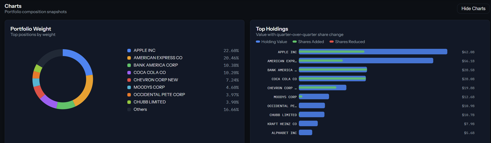
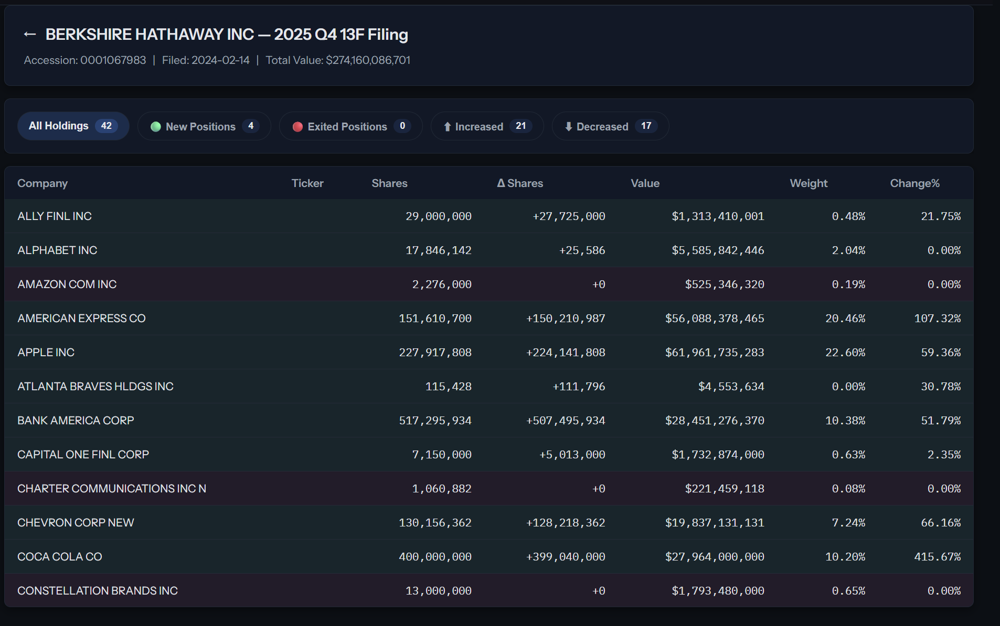

# WhaleSquare

**Track institutional equity holdings from SEC 13F filings — in real time, with a clean dark UI.**

Pick an institution, select a quarter, and instantly see their full portfolio: position weights, quarter-over-quarter share changes, and value breakdowns.





---

## Features

- **Live EDGAR data** — parses real SEC 13F XML filings with in-memory caching
- **Institution selector** — Berkshire Hathaway, BlackRock, Vanguard, Tiger Global, Third Point
- **Quarter switching** — per-quarter holdings with historical comparison
- **Cross-quarter deltas** — `changeShares` computed against prior filing automatically
- **Holdings table** — sortable columns, sticky header, horizontal scroll on mobile
- **Portfolio charts** — weight donut + top holdings bar, rendered as hand-written SVG (no chart library)
- **Value Trend** — quarter-over-quarter portfolio value curve
- **Metrics strip** — total value, holdings count, largest position, new positions this quarter
- **Delta animations** — count-up animation with directional arrows via Framer Motion
- **Loading skeletons + error states** — graceful fallback at every data boundary
- **Dark design system** — consistent tokens for color, spacing, typography (see `DESIGN.md`)
- **Responsive** — adapts from desktop to mobile; charts reflow on narrow screens

---

## Quickstart

```bash
npm install
npm run dev:full
```

- App → http://localhost:5173  
- EDGAR proxy → http://localhost:5174

### Mock mode

```bash
VITE_USE_MOCK=true npm run dev
```

Bypasses EDGAR and uses bundled mock data — useful for UI development offline.

---

## Scripts

| Command | Description |
|---|---|
| `npm run dev` | Vite dev server only |
| `npm run dev:server` | EDGAR proxy on :5174 only |
| `npm run dev:full` | App + proxy together (recommended) |
| `npm run build` | Type-check + production build |
| `npm run preview` | Serve production build locally |
| `npm run test` | Run unit tests (Vitest) |

---

## Architecture

```
src/
  pages/          Dashboard, Institution, Filing
  components/     HoldingsTable, WeightDonut, TopHoldingsBar, ValueTrend, Sparkline, …
  store/          Zustand global state
  data/           EDGAR fetch client + types
  utils/          formatNumber, formatPercent, transitions

api/
  13f/[cik].ts   Vercel Serverless Function — EDGAR proxy + CUSIP dedup + top-200 trim

server/
  index.ts        Express dev proxy (local only)
  edgarProxy.ts   Core EDGAR fetch + cache logic
```

**Stack:** React · TypeScript · Vite · Zustand · TanStack Table · Framer Motion · Vercel

---

## Deployment

Production: [whale-square.vercel.app](https://whale-square.vercel.app)

The Vercel Serverless Function handles all SEC EDGAR fetching server-side with a 5-minute CDN cache (`s-maxage=300`). No backend required in production.

---

## Docs

- `DESIGN.md` — visual system, color tokens, typography
- `CONTRIBUTING.md` — local setup, workflow, branching, and testing
- `CHANGELOG.md` — shipped changes by date
- `CLAUDE.md` — agent-specific instructions for AI-assisted development
