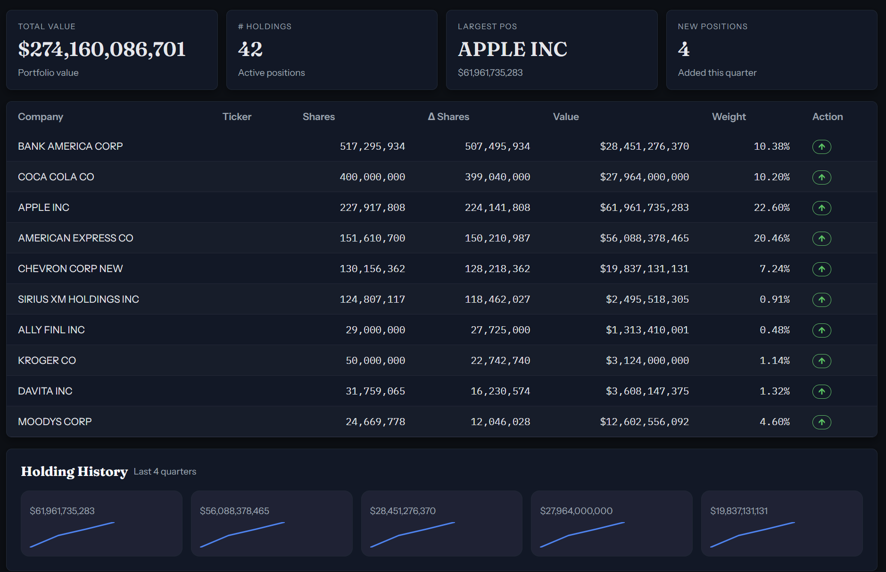
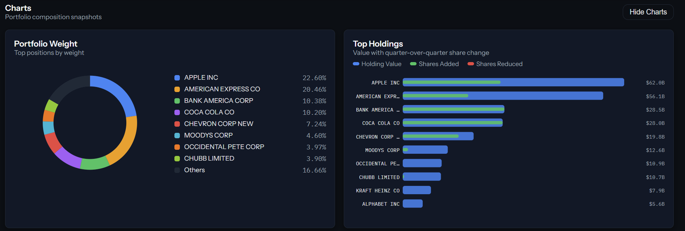

# WhaleSquare

**Track institutional equity holdings from SEC 13F filings — live data, dark UI, zero fluff.**

Pick an institution, select a quarter, and instantly see their full portfolio: position weights, quarter-over-quarter share changes, value breakdowns, and holding history.

---

## Screenshots





---

## Highlights

- **Live SEC EDGAR data** — real 13F XML parsed on-demand, no third-party data vendor
- **Quarter-over-quarter deltas** — `Δ Shares` computed automatically against the prior filing
- **Portfolio charts** — weight donut + top-10 holdings bar, hand-written SVG (no chart library)
- **Value Trend** — quarter-over-quarter portfolio value curve
- **Metrics strip** — total AUM, holdings count, largest position, new positions this quarter
- **Holdings table** — sortable columns, sticky header, row-level action badges
- **Holding History** — sparkline cards for top 5 positions
- **Client-side cache** — institution data cached in-memory (5 min TTL); background prefetch on load so switching institutions is instant
- **Responsive** — adapts from widescreen to mobile; charts and metrics reflow gracefully
- **Dark design system** — consistent tokens for color, spacing, and typography (see `DESIGN.md`)

---

## Quickstart

```bash
npm install
npm run dev:full
```

- App → http://localhost:5173
- EDGAR proxy → http://localhost:5174

### Mock mode

```bash
VITE_USE_MOCK=true npm run dev
```

Bypasses EDGAR and uses bundled mock data — useful for UI development offline.

---

## Scripts

| Command | Description |
|---|---|
| `npm run dev` | Vite dev server only |
| `npm run dev:server` | EDGAR proxy on :5174 only |
| `npm run dev:full` | App + proxy together (recommended) |
| `npm run build` | Type-check + production build |
| `npm run preview` | Serve production build locally |
| `npm run test` | Run unit tests (Vitest) |

---

## Architecture

```
src/
  pages/          Dashboard, Institution, Filing
  components/     HoldingsTable, WeightDonut, TopHoldingsBar, ValueTrend, Sparkline, …
  store/          Zustand global state (with institution cache)
  data/           EDGAR fetch client + types
  utils/          formatNumber, formatPercent, transitions

api/
  13f/[cik].ts   Vercel Serverless Function — EDGAR proxy + CUSIP dedup + top-200 trim

server/
  index.ts        Express dev proxy (local only)
  edgarProxy.ts   Core EDGAR fetch + cache logic
```

**Stack:** React · TypeScript · Vite · Zustand · TanStack Table · Framer Motion · Vercel

---

## Deployment

Production: [whale-square.vercel.app](https://whale-square.vercel.app)

All SEC EDGAR fetching is handled server-side via Vercel Serverless Functions with a 5-minute CDN cache (`s-maxage=300`). No separate backend required in production.

---

## Docs

- `DESIGN.md` — visual system, color tokens, typography
- `CONTRIBUTING.md` — local setup, workflow, branching, and testing
- `CHANGELOG.md` — shipped changes by date
- `CLAUDE.md` — agent-specific instructions for AI-assisted development
